# Universal Source-Free Domain Adaptation文献阅读

## 【1】CVPR2020

### 摘要

from source domain(labeled) to target domain (unlabeled)

各种source-target label-set relationship（如下图）

【two-stage learning process】

[1] **Procurement-stage**, assume no prior knowledge of the upcoming category-gap and domain-shift. 

没有分类差距和领域迁移的先验知识

reject out-of-source samples by a generative classifier

[2] **Deployment-stage**, design an adaptation algorithm with no access to the seen source samples.

跨广泛的类别间隙进行操作

【源相似度度量（SSM）】

instance-level weighting mechanism

### Intro

**DA algorithms**

[1] 学习一个域不变的特征表示

[2] 通过对抗性分布匹配学习独立变换到一个共同的潜在表示

### Method

**第一个阶段Procurement**

使用负类的具有类间可分离性的类内紧凑性，使用已知的类为新的类生成语义

[1] 学习最适合所有类别间隙场景的源集群的特定位置，无源场景不允许我们在适应过程中修改目标样本存在的位置。

[2] 具有拒绝分布外样本的能力，这是域移下无监督适应的必要要求。

【2 regularization strategies】

[1] labeled negative source dataset生成潜在空间

[2] 生成模型正则化

**第二个阶段Deployment**

**SSM**
$$
F_t：领域特定的特征提取器 \notag \\
x_t：目标样本 \notag \\
w(x_t)：SSM相似度 \notag \\
p_s^-：source样本，label是\overline{C_s} \notag \\
q_t^-：target样本，label是\overline{C_t} \notag \\
$$
w大，表示更趋近C空间（公共标签领域）

w小，表示更趋近C_t空间（私有目标标签）

**source-free领域适应**

d1的损失函数

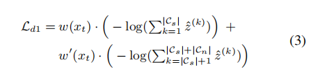

d2的损失函数

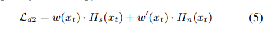

H是信息熵，s for source, t for target

## 【2】Neurocomputing综述

**SFUDA方法分类**

[1] self-tuning，自调整

[2] feature alignment，特征对齐

[3] sample generation，样本生成

**现有的UDA方法**

[1] 通过对齐从源域和目标域中提取的特征分布之间的统计矩来实现自适应

[2] 将域鉴别器纳入学习过程来区分源特征和目标特征，同时也引导特征提取器为源样本和目标样本生成相似的特征，以“欺骗”域鉴别器。

**workflow = pre-training + adaptation**

> **stage1: pre-training**

a feature extractor: X to Z

a classifier: Z to C_s

> **stage2: adaptation**

$$
h_t=c_t*f_t，weights = \theta_{h_s}
$$

**self-tuning methods**

[1] pseudo labeling

可分为feature-space方法（基于特征空间关系产生伪标签）和output-space方法（基于输出预测产生伪标签）

> feature-space
>
> 聚类
>
> [1] centroids construction 质心构造
>
> [2] label refinement, filtering, or weighting 标签细化
>
> [3] model adaptation模型适应（domain-invariant和domain-specific权重）

> output-space
>
> 第一阶段：生成cleaner pseudo labels
>
> 第二阶段：cleaner labels被用于训练或微调模型

[2]regularization-based learning

> 具体分类
>
> [1] information maximization
>
> [2] jacobian norm
>
> [3] early learning

[3] multi-task learning

**特征对齐方法**

[1] intra-domain alignment域内对齐

> inner structural relation内部结构关系
>
> pseudo domain by target samples目标样本的伪域

[2] inter-domain alignment域间对齐

> pseudo domain by new samples新样本的伪域
>
> hidden source information隐藏的源信息

**样本生成方法**

[1] source generation：把目标样本生成为似源样本，预处理后由source-model分类

[2] target generation：生成有标签的目标样本，训练target-model

[3] intermediate domain generation：生成中间域桥接源域和目标域，增加可转移性

**评价框架**

[1] 适应过程中的学习模型

[2] 训练模型的损失

[3] 适应后的推理pipeline

**future方向**

1：适应新的领域且不遗忘源领域的先验知识

2：深入创建自我监督学习方法

3：arch从CNN（ResNet）转为transformer

4：大模型的parameter-efficient

## 【3】Neural-Networks综述

UDA分类（根据source model和source data的可访问性）

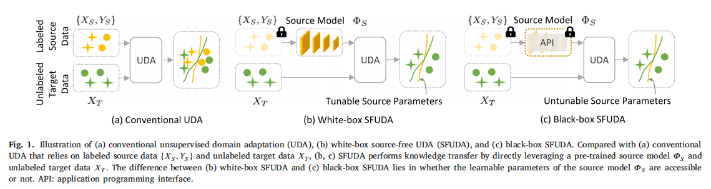

mind-map

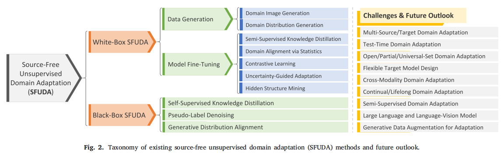

**white box SFUDA**：

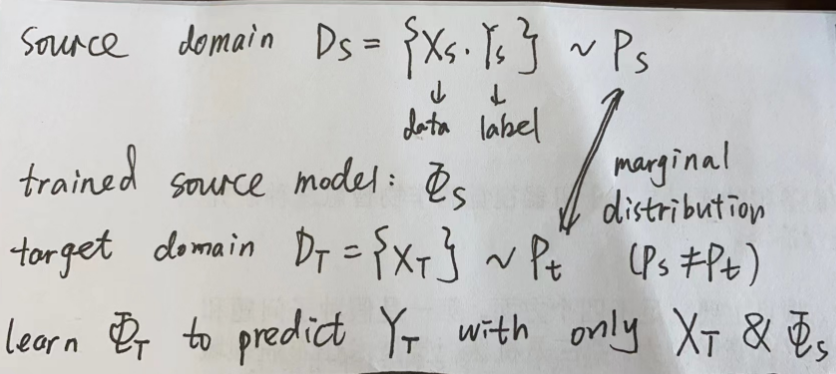

**（1）Data Generation**

（1.1）Domain image generation

（1.1.1）Batch Normalization Statistics Transfer

匹配上、下分支之间的批处理归一化（BN）统计信息

> 可结合循环学习circular learning

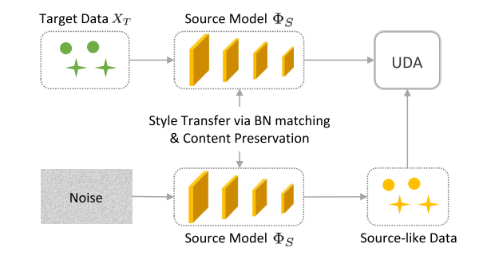

（1.1.2）Surrogate Source Data Construction

首先通过从目标域中选择合适的样本来构建代理/代理源数据，然后执行标准的UDA

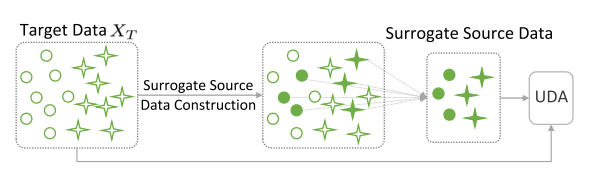

（1.1.3）Generative Adversarial Network, GAN

预定义的label和随机噪声，通过GAN模拟source data，然后和target data一起UDA

> 可能存在模式崩溃，需要精调学习率、manifold-guided training、virtual mapping等方法缓解

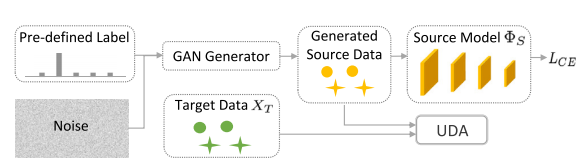

（1.2）Domain distribution generation

**（2）Model Fine-Tuning**

（2.1）self-supervised knowledge distillation

> via a mean-teacher scheme
>
> 以不同增强（例如flip、noise addition）的目标数据作为输入，利用师生框架拟合目标特征，其中教师网络的参数通常是学生网络的指数移动平均EMA

瓶颈：师生网络参数过耦合

> dual-student framework？

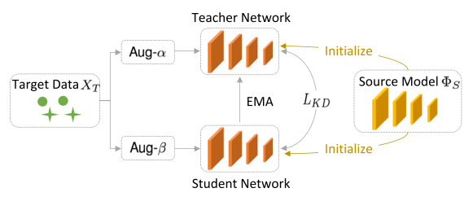

（2.2）domain alignment via statistics

减少源域和目标域之间的分布差异来执行跨域自适应

> 适用于real-time deployment

仅使用批处理归一化技术进行自适应可能不够

> consistent regularization
>
> confidence-filtered pseudo labeling
>
> bottom-up feature restoration
>
> cross-domain statistics controlling

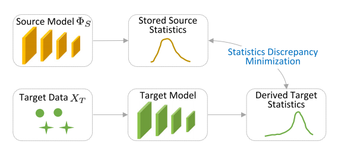

（2.3）contrastive learning

通过labeled-data缩小类内距离，扩大类间距离（类似LDA？）

> 噪声不耐受
>
> 需要记录当前adaptation和历史adaptations的相似度，要求一定的内存

解决方法：利用目标数据与其增广数据间的对比信息

强增强：扭曲原始图像的结构（shape distortion）

弱增强：限制转换以保持图像的结构（flip）

动态混合目标数据的强增强和弱增强

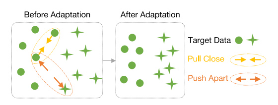

（2.4）uncertainty-guided adaptation

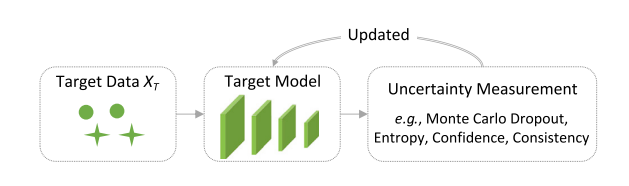

（2.5）hidden structure mining 

目标域的内在特征结构，聚类质心更新迭代

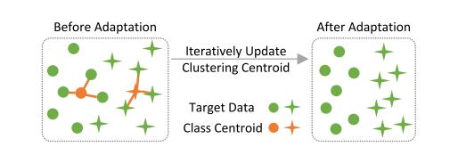

> 缺点：
>
> 需要在特征聚类和模型更新之间进行迭代——memory burden
>
> 难以保存整个数据集的全局潜在特征嵌入
>
> 在欧几里得空间中构造目标几何结构

**black box SFUDA**：

源数据{𝑋𝑆，𝑌𝑆}和源模型𝛷𝑆的详细参数都无法访问

目标模型𝛷𝑇：{𝛷𝑆（𝑋𝑇），𝑋𝑇}⇒𝑌𝑇

分类：

**（1）self-supervised knowledge distillation**

teacher–student-style network

教师网络没有利用学生网络的任何参数细节，只通过源预测和历史目标预测进行更新（通常由一个动量因子来加权）。

**（2）pseudo-label denoising**

通过去噪不可靠的目标伪标签来解决domain shift

只关注噪声预测本身，忽略目标数据结构

*在类不平衡的情况下，可结合知识蒸馏（有目标数据结构）*

**（3）generative distribution alignment**

通过最小化source domain和target domain之间的特征分布差异来执行领域自适应

**white box和black box之间的差异**

【1】性能

【2】privacy

【3】计算和内存成本

**常用数据集**

**提高通用性的策略**

【1】熵最小化损失，Entropy minimization loss

【2】多元化强制执行损失，Diversity enforcing loss

> 最大化经验标签分布的熵超过模型预测的批处理平均值

【3】标签平滑化，Label smoothing 

> 将原始的训练标签从硬标签（如1）转换为软标签（如0.95）

【4】模型正则化，Model regularization

> 局部光滑正则化、早期学习正则化...

【5】置信阈值，Confidence thresholding

> 学习每个类别的动态阈值

**future work**

【1】Multi-source/target domain adaptation

key：量化不同源模型的可转移性，并利用它们的互补信息来促进领域的自适应

【2】Cross-modality domain adaptation

...

