# 会议阅读

## [1] LEAD

**主要困难：**

determine whether covariate-shifted samples belong to target-private unknown categories.

**目前的解决方法：**

(1) hand-crafted threshold

(2) develop time-consuming iterative clustering strategy

**新方法LEAD: learning decomposition**

在source数据中，分解特征为已知和未知，进而识别target-private数据

（1）利用正交分解分析来进行特征分解

（2）采用双分量高斯混合模型（GMM）来估计未知标签的2-范数分布

（3）设计common score系数，用于计算target prototypes和source anchors的距离，进而构建实例级的决策边界，划分target-private数据

**优势**

H-score高、获得伪标记决策边界的时间短

**作者设想**

target-private data from unknown categories exhibit a higher proportion of components from the orthogonal complement (source-unknown) space spanned by source model weights

**框架图**

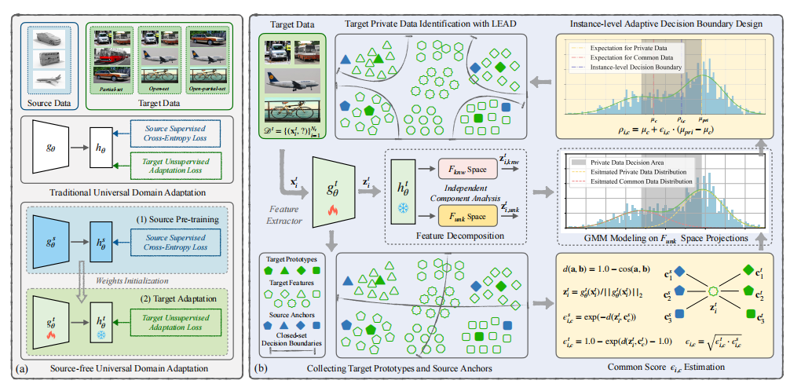

**方法**

**数学背景**

*source model*

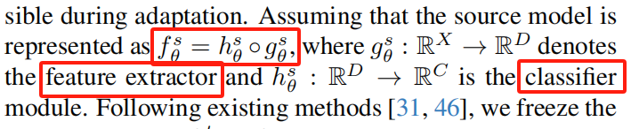

g^s是特征提取器，h^s是分类模块

**正交特征分解**

分解为两个无关空间F_known和F_unknown

F_known：features with source-known space

F_unknown：features with source-unknown space

> 推导过程：

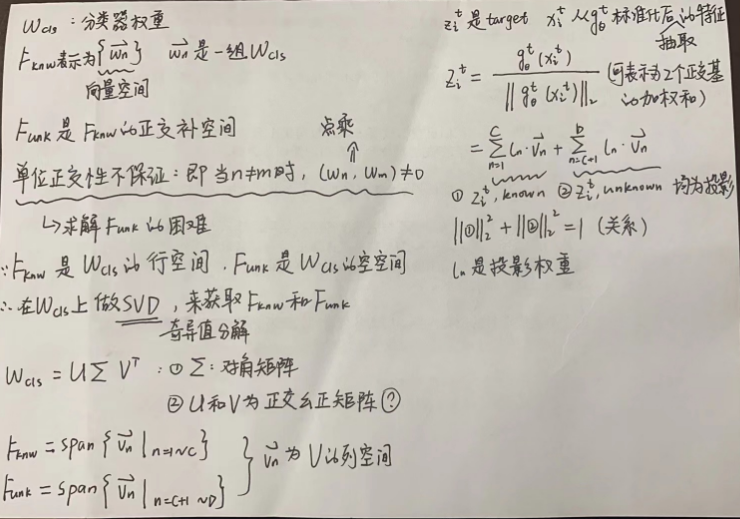

**自适应地分离private data**

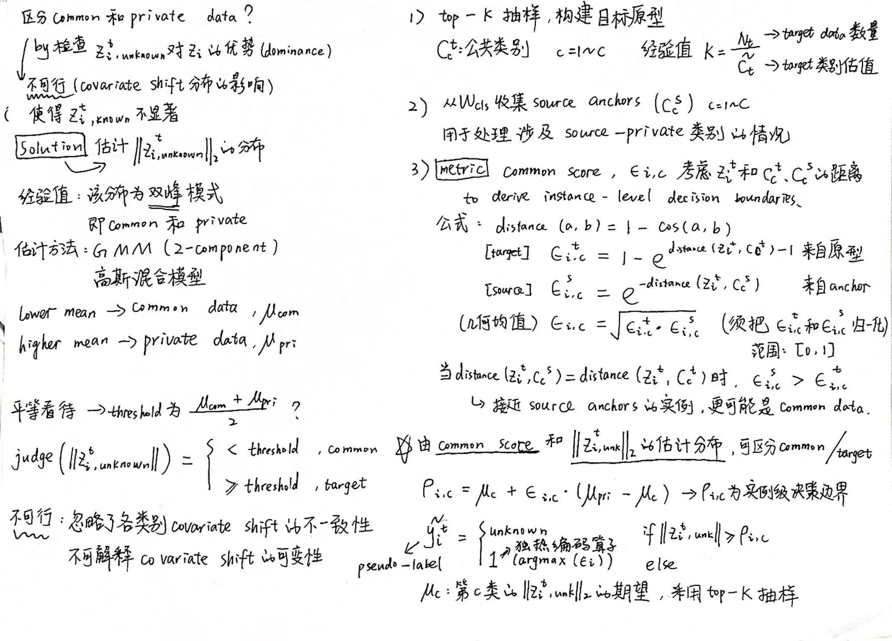

**优化目标**

【1】伪标签学习

公式：

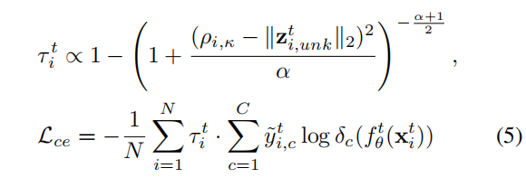

相关解释：

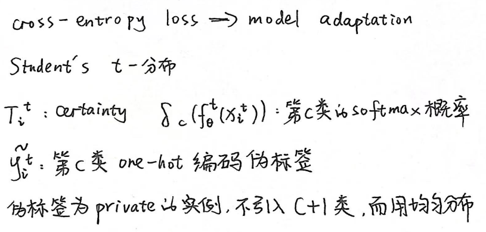

【2】特征分解正则化

目的：

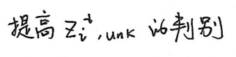

公式：

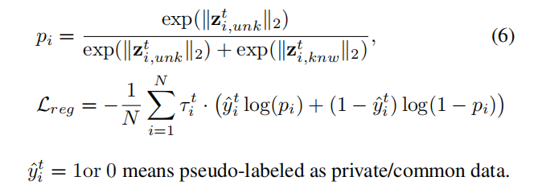

【3】特征共识正则化

目的：帮助模型实现更稳定的性能

【4】最终的损失函数

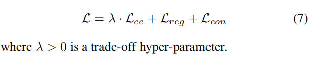

**消融实验**

对L_ce、L_reg、L_con做消融

## [2] GLC++ 

**目的**

accurately classify "known" data belonging to common categories and segregate them from target-private “unknown” data.

把属于common的已知数据剥离于target-private中的未知数据

**GLC**

global and local clustering

(1) one-vs-all global clustering, 识别目标类（metric为Silhouettes，避免source-private则采用global confidence）

(2) local k-NN clustering, 减轻负转移

缺点：“未知”数据被视为一个整体，聚类没有细化和识别

**GLC++**

融合了对比亲和学习策略（优化GLC的缺点）

**创新点**

（1）with only a standard pre-trained closed-set model.

（2）an innovative one-vs-all global clustering based pseudo-labeling algorithm，实现不同类别转移下的“已知”和“未知”数据样本分离

（3）a new contrastive affinity learning

strategy，提高在目标私有“未知”数据之间识别不同类别的能力

> 具体方法：construct contrastive pairs according to their
>
> distance in the manifold space，根据在流形空间中的距离构造对比对

**框架图**

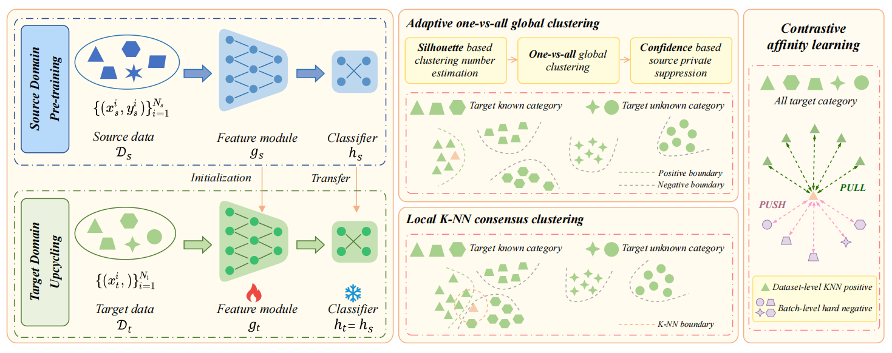

**method**

第一部分：

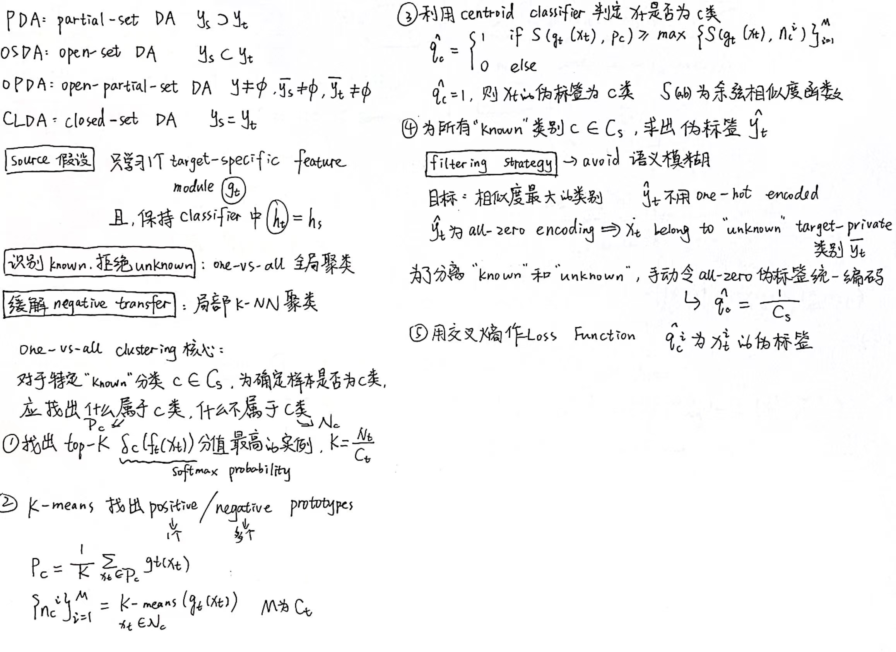

第二部分：

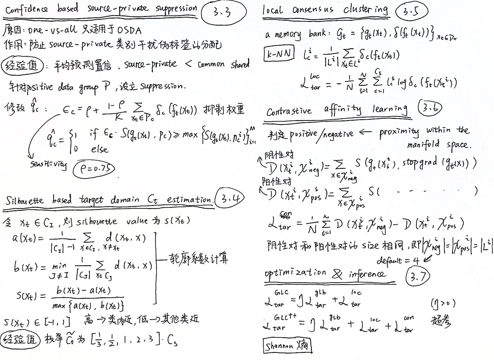

## [3] COCA

**存在问题**

现有SF-UniDA方法仍然需要大量有标签的source data，会造成显著的label成本

Vanilla UDA methods are designed for the closed-set scenario. 

**创新**

即插即用的模块COCA，Classifier-Oriented Calibration

【1】在SF-UniDA中结合few-shot和zero-shot技术。提出新范式，专注于classifier，而不是图像的encoder optimization。

【2】自动校准。利用文本原型（textual prototypes，**ACTP**）。提出the mutual information enhancement by context information (**MIECI**) module，鼓励classifier挖掘图像特征中的文本信息。

【3】证明了VLMs已封装源域和目标域的知识。这使得VLM驱动的模型能够自主地适应新的目标域。

**用途**

few-show learning with vision-language models (VLM)

**框架图**

对比图：利用并冻结image encoders和text encoders，调整closed-set classifier

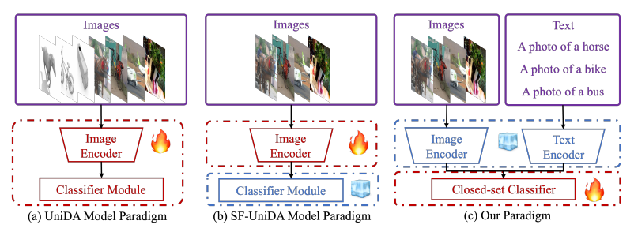

target-domain适应阶段图

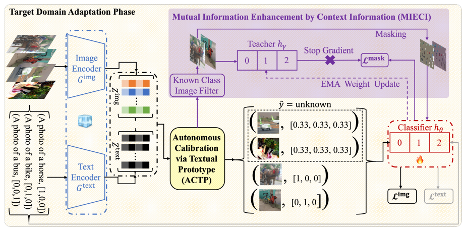

自动校准中，ACTP模块图

ACTP用于区分common和unknown

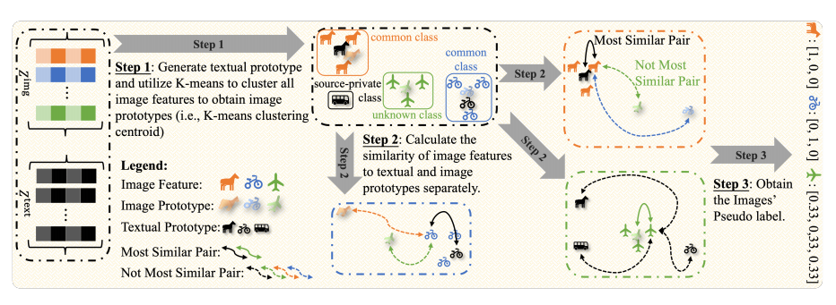

**methods**

【1】Autonomous Calibration via Textual Prototype

【1.1】Positive and Negative Prototypes

x_i属于known类别c的概率

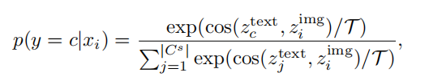

定位已知类c的负原型，采用K-means

根据信息瓶颈理论，需要最大化目标函数

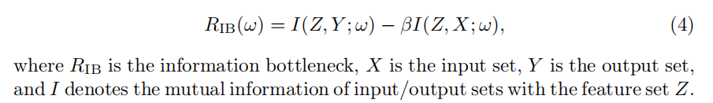

可证明：在R_IB函数中，Z^text的对应值比V^img的对应值更大。

【1.2】Self Training

ACTP模块生成pseudo label

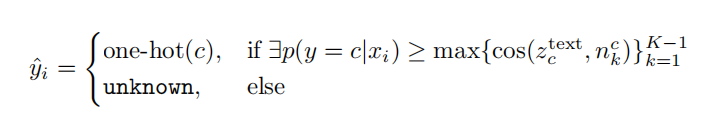

当遇到unknown时，均分概率

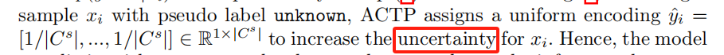

【1.3】Image Loss and Text Loss

图像交叉熵损失

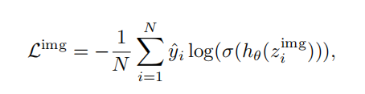

文本交叉熵损失

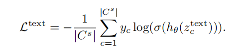

【1.4】Optimal K Determination

只在第一个epoch估计K的值

【2】Mutual Information Enhancement by Context Information

【2.1】Masked Image and EMA Teacher

掩码M随机采样自均匀分布（uniform distribution）

EMA的权值通过hθ与平滑因子α的权值进行更新

【2.2】Mask Loss

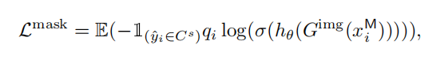

【3】Model Optimization

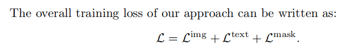

【3.1】Decision Boundary Adaptation

不需要显式设计域散度measurement term的原因：

1：如果适当地使决策边界适应于目标域，分类误差不需要明确地设计一个域移位损失项就会很低。

2：the knowledge of both the source and target domains has been encapsulated within the VLMs

核心：指导分类器建立一个更合适的决策边界

【4】inference

normalized Shanon Entropy => 测量target样本的不确定性，区分common和unknown类别

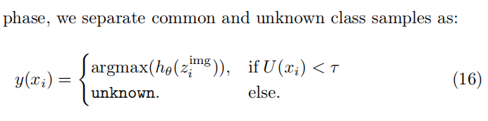

τ=设置为0.55

